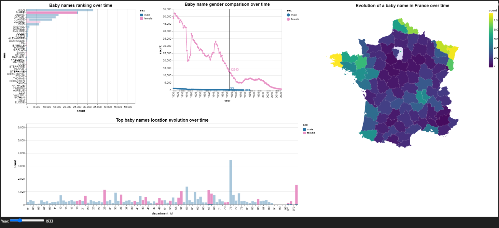

# Students:
### BOUVRY Maxime 
### BREJON Louis   

# Subject:
In this mini-project, we will be working with a data set of baby names in France. It contains the list of all baby names registered in France, year by year, from 1900 through 2019. There are two data sets: one aggregated to the national level, and another with data by department. Your goal is to create 3 different visualizations around these data, each focussed on answering different kinds of questions about the data:

- Visualization 1: How do baby names evolve over time? Are there names that have consistently remained popular or unpopular? Are there some that have were suddenly or briefly popular or unpopular? Are there trends in time?

- Visualization 2: Is there a regional effect in the data? Are some names more popular in some regions? Are popular names generally popular across the whole country?

- Visualization 3 (bonus): Are there gender effects in the data? Does popularity of names given to both sexes evolve consistently? (Note: this data set treats sex as binary; this is a simplification that carries into this assignment but does not generally hold.)

This assignment consists of two parts: in the first part, you will sketch design alternatives for different visualizations that can help address each set of questions. In the second part, you will implement that visualization using one of the tools from the class lab assignments.

--------------------------------------------------------------------------------------------------------

### Link: https://perso.telecom-paristech.fr/eagan/new/class/igr204/baby-names

--------------------------------------------------------------------------------------------------------

# Week 1: Design sketches
Your final visualization should enable the user to answer all of these questions with a single interactive visualization. If your design does not allow this, try to think of alternative designs that will help do so. The focus here is on design alternatives for your visualizations.

You may hand draw your designs or use software as you prefer. For each visualization, you may—and are encouraged to—submit more than one solution. In your submission, you should include a discussion of the strengths and weaknesses of each design.

# Week 2: Implementation
For each of the three visualizations above, choose one to implement, using one of the tools from our class labs. Your submission will include:

A link to a Git repository with your code.
A description of why you think this solution is appropriate and effective at answering these questions.
(If you are stuck answering all these questions in a single visualization, you may submit multiple solutions; be sure to compare and contrast them.)

# Grading
Your grade will be based on the final implementation that you will hand in at the end. It is based on:

Does the visualization convey they answer to all of these questions?
Does the visualization clearly convey the answer to each of these questions?
Is the visualization clear and have good aesthetics?

# Run the code
You need to go in the ***notebooks/7.0-main.ipynb*** notebooks to see visualizations (you can execute all cells if you want but interactions already work). The final interactive visualization that gathers the all visualizations can be found at the end of the notebook. You can use the slider to see interactions. You can find a snapshot below:

